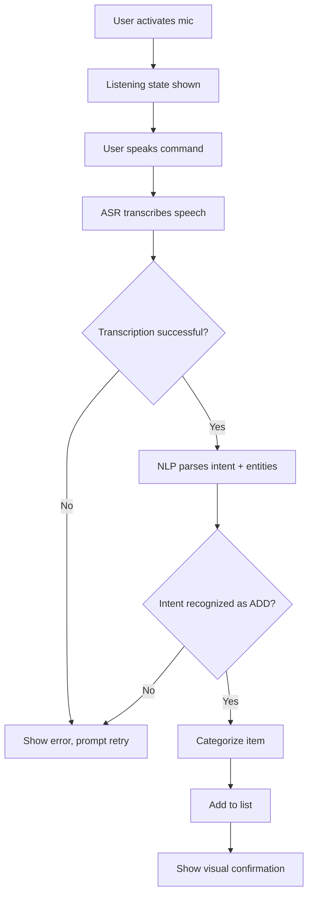

# Voice Command Shopping Assistant — PRD & Task Definitions

**Source Document:** Technical Assessment Project email ("Voice Command Shopping Assistant")
**Prepared as:** Implementation-ready PRD + Engineering Task Breakdown


---

## 1. Requirements Analysis

The Requirements File is a recruiting email describing a take-home technical assessment. It defines a product ("Voice Command Shopping Assistant") through a bulleted feature list, plus process/logistics requirements (deliverables, timeline, evaluation criteria). It is **not** a full product spec — it is intentionally open-ended so the candidate can make design decisions.

**Structural anomaly in the source (flagged, not corrected):** The feature list is numbered 1, 2, 3, 4, then jumps to 11, 12. Sections 5–10 do not appear in the provided text. This could mean (a) the original document had sections 5–10 that were omitted when this email was pasted, or (b) the numbering is simply non-sequential in the original template and no content is missing. This is logged as **OQ-001** below. Nothing has been invented to fill the gap.

Extracted elements:

- **Product objective:** A voice-first shopping list manager with NLP-driven input and smart, personalized suggestions.
- **Actors:** A single implied actor — "the user" (an end consumer). No admin, multi-user household, or retailer-side actor is mentioned.
- **Functional areas stated:** Voice input/NLP/multilingual support; smart suggestions (recommendations, seasonal, substitutes); list management (add/remove/modify, categorize, quantity); voice-activated search (item + price-range filtering); UI/UX (minimalist, visual feedback, mobile/voice-only); hosting.
- **Non-functional/technical requirements stated:** Clean production-quality code, basic error handling, loading states, simple documentation.
- **Constraints stated:** 8-hour time budget, free-tier AI/ML services only, public test data only, any framework allowed.
- **Deliverables stated:** Hosted app URL, GitHub repo + README, ≤200-word approach write-up.
- **Evaluation criteria stated:** Problem-solving approach, code quality, working functionality, documentation.
- **Not stated:** data persistence/accounts, specific languages for multilingual support, specific NLP/ASR provider, specific recommendation algorithm, specific hosting platform (examples given, not mandated), specific UI framework, security/auth model, offline behavior, monetization, retailer integration, error message copy, performance targets, accessibility targets, analytics requirements.

---

## 2. Scope Summary

**In scope (explicit):** Voice-driven add/remove/modify of shopping list items; NLP intent parsing for varied phrasing; multilingual voice input; product/seasonal/substitute suggestions; item categorization; quantity handling; voice search with price/brand filtering; minimalist mobile/voice UI with visual feedback and loading states; hosted deployment; basic error handling; README documentation.

**Out of scope:** Anything not listed above. The requirements do not define exclusions explicitly, so no formal "Non-Goals" list can be derived with confidence beyond "no feature outside the stated list should be built," per the 8-hour constraint and the instruction not to invent scope.

---

## 3. Assumptions

Per the fidelity rules, everything below is labeled and none of it should be treated as confirmed requirement. Given the 8-hour ceiling, a real candidate would need to make these calls quickly — they are presented as the minimum viable assumptions needed to start building, not as endorsed decisions.

| ID | Assumption | Type | Rationale |
|----|------------|------|-----------|
| A-001 | Single anonymous user, no login/auth, data persisted client-side (e.g., localStorage) or in-memory only | ASSUMPTION | No auth/account requirement stated; 8-hour budget makes backend user management impractical |
| A-002 | "Multilingual support" = at least 2 languages (e.g., English + 1 other) using the ASR/NLP provider's built-in language detection, not custom-trained models | ASSUMPTION | No language list given; free-tier constraint limits scope |
| A-003 | Voice recognition uses the browser's Web Speech API or a free-tier third-party ASR (e.g., a cloud STT free tier) rather than a self-hosted model | ASSUMPTION | "Free tier" and 8-hour budget stated explicitly |
| A-004 | "Product recommendations based on shopping history" can use a small local/mock dataset or session history rather than a live purchase history system | ASSUMPTION | No data source specified for "history" |
| A-005 | "Seasonal recommendations" and "substitutes" are rule-based/lookup-table driven rather than ML-trained | ASSUMPTION | Time and free-tier constraints |
| A-006 | Hosting is a single free-tier static/serverless deployment (e.g., Vercel, Netlify, Firebase Hosting) | ASSUMPTION | Examples given are illustrative ("e.g., AWS, Firebase, Google Cloud"), not mandatory |
| A-007 | "Price range filtering" operates against a mock/sample product catalog, not a live retailer API | ASSUMPTION | No retailer integration or product database specified |

---

## 4. Open Questions & Clarifications Required

| ID | Question | Why It Matters | Possible Options | Decision Needed From |
|----|----------|-----------------|-------------------|-----------------------|
| OQ-001 | Are sections 5–10 (between "Voice-Activated Search" and "UI/UX") missing content, or is the numbering intentionally non-sequential? | If content is missing, real requirements may be undocumented | (a) No content missing, renumber and proceed; (b) Request the missing sections from the employer | Hiring manager / recruiter (source of the email) |
| OQ-002 | What specific languages must "multilingual support" cover? | Determines ASR/NLP provider choice and testing scope | (a) English only + stretch goal for 1 more; (b) Specific list required | Employer |
| OQ-003 | What defines "shopping history" — is any persistence/backend expected, or is this a single-session concept? | Determines whether a backend/data store is required at all | (a) Session-only mock history; (b) Persisted local storage; (c) Real backend | Employer |
| OQ-004 | What product/price data source should power search, filtering, and substitutes? | No catalog or API is named | (a) Candidate-authored mock dataset (public/sample data); (b) Public grocery API if one is designated | Employer ("free to use... public sources" implies candidate discretion, but no specific source is named) |
| OQ-005 | Is "voice-only interaction" a hard requirement (no visible UI needed to operate the app), or does "mobile/voice-only interface" simply mean the app is optimized for both mobile touch and voice? | Significantly changes UI scope and accessibility approach | (a) Voice-first with visual UI as support; (b) Strictly voice-only, no touch controls | Employer |
| OQ-006 | Given the 8-hour cap, is partial/mocked implementation of lower-priority features (e.g., seasonal recommendations) acceptable, or must every bullet be functional? | Directly affects task prioritization and what "done" means | (a) Full coverage required; (b) Core flow (voice add/remove/search) must be robust, others may be simplified/mocked | Employer |
| OQ-007 | Does the deadline referenced in the source email (1 Sep 2025) reflect the real, current deadline? | The email as provided appears to reference a past date | Confirm actual current deadline with the employer before starting work | Employer |

---

## 5. Complete PRD

### 5.1 Executive Summary

- **Feature name:** Voice Command Shopping Assistant
- **Problem being solved:** Manually typing/managing a shopping list is slower and less convenient than speaking naturally, especially on mobile. Users also forget recurring or seasonal needs.
- **Objective:** Let a user build and manage a shopping list entirely by voice, using natural phrasing, with the system offering relevant suggestions and substitutes.
- **Expected outcome:** A working, hosted, voice-driven shopping list app demonstrating NLP intent parsing, list CRUD, basic recommendation logic, and voice search/filtering, built within an 8-hour engineering budget.
- **Scope:** Single-user, client-facing web (mobile-optimized) application; no backend user accounts required unless the candidate chooses to add one.

### 5.2 Background & Context

The requirements frame this as a practical skills assessment rather than a production roadmap. The "why" given is implicit: evaluate a candidate's ability to combine voice/NLP integration, list-management logic, basic recommendation heuristics, and clean UI/UX delivery under a tight time box. No market or user-research background is provided beyond the feature list itself.

### 5.3 Goals

- G-001: User can add an item to the shopping list using a spoken command in natural, varied phrasing. *(EXPLICIT)*
- G-002: User can remove or modify list items by voice. *(EXPLICIT)*
- G-003: User can speak in more than one language and be understood. *(EXPLICIT)*
- G-004: User receives suggestions (recommended, seasonal, substitute) relevant to their list. *(EXPLICIT)*
- G-005: User can search/filter products by voice, including brand, size, or price range. *(EXPLICIT)*
- G-006: The app is deployed and reachable via a public URL. *(EXPLICIT)*
- G-007: The codebase and documentation are clear enough for a reviewer to understand the approach without back-and-forth. *(EXPLICIT — stated as an evaluation criterion)*

No numeric/measurable success metrics (e.g., recognition accuracy %, latency targets) are provided in the source, so goals are stated qualitatively per the fidelity rule.

### 5.4 Non-Goals / Out of Scope

The requirements do not explicitly define exclusions. Based on what is *not* mentioned anywhere in the source, the following are reasonably treated as out of scope (labeled DERIVED, since the absence of a requirement is being used to infer scope boundaries):

- Multi-user/household shared lists — *DERIVED (not mentioned)*
- Retailer checkout/payment/ordering integration — *DERIVED (not mentioned)*
- Native mobile app (iOS/Android binaries) — *DERIVED (only "mobile-optimized" interface is required, not a native app)*
- User accounts, authentication, or long-term cross-device persistence — *DERIVED (not mentioned; see OQ-003)*
- Offline voice recognition — *DERIVED (not mentioned)*

**OPEN QUESTION:** Since the source never states exclusions directly, none of the above should be treated as confirmed — see OQ-006 on whether partial coverage is acceptable at all.

### 5.5 Users / Actors

| Actor | Description | Responsibilities | Permissions | Relevant Workflows |
|-------|--------------|-------------------|-------------|---------------------|
| Shopper (End User) | The single user type described in the requirements | Speaks commands to add/remove/search/filter items; reviews suggestions | Full control over their own list (no restricted actions defined) | All workflows in Section 5.6 |

No other actor (admin, retailer, support agent) is mentioned in the source.

### 5.6 User Journeys / Workflows

#### Workflow 1: Add Item by Voice

**Trigger:** User activates voice input and speaks a command such as "Add milk" or "I need apples."
**Preconditions:** Microphone permission granted; app loaded and ready to listen.
**Steps:**
1. User taps/activates the mic control.
2. App shows a "listening" state.
3. User speaks a command.
4. App transcribes speech to text (ASR).
5. NLP layer parses intent (ADD) and entity (item name, optional quantity).
6. Item is added to the list and categorized.
**System Behavior:** Real-time (or near-real-time) transcription and parsing; visual confirmation of the recognized item.
**Success State:** Item appears in the list under its category with visual confirmation (e.g., "Added: Milk").
**Failure State:** Unrecognized speech or unparseable intent → app shows an error/retry state, does not silently fail.
**Edge Cases:** Ambiguous phrasing ("I need some stuff for pasta"), duplicate item already on list, background noise causing misrecognition.



#### Workflow 2: Remove/Modify Item by Voice

**Trigger:** User says "Remove milk from my list" or "Change apples to 3."
**Preconditions:** Item already exists on the list (for remove/modify).
**Steps:** Same ASR → NLP pipeline as Workflow 1, with intent classified as REMOVE or MODIFY, targeting an existing list entry.
**System Behavior:** Matches spoken item name against current list (fuzzy match to tolerate phrasing variance).
**Success State:** List updates and confirms the change visually.
**Failure State:** Item not found on list → app tells the user the item isn't present, does not crash or silently ignore.
**Edge Cases:** Item name spoken doesn't exactly match stored name ("almond milk" vs. "milk"); multiple similar items on the list; user asks to remove an item not present.

#### Workflow 3: Voice Search & Filter

**Trigger:** User says "Find me organic apples" or "Find toothpaste under $5."
**Preconditions:** A product dataset (per A-007) is available to query.
**Steps:** ASR → NLP extracts search term + optional filters (brand, size, price ceiling/range) → query executed against product data → results displayed.
**System Behavior:** Parses comparative/range language ("under $5", "between $3 and $5").
**Success State:** Matching results are shown; user can add a result to the list by further voice command or tap.
**Failure State:** No matches → app states no results found rather than showing nothing with no explanation.
**Edge Cases:** No price constraint given; ambiguous brand names; zero results; conflicting filters.

#### Workflow 4: Smart Suggestions

**Trigger:** Passive — triggered on list view load or after an add/remove action.
**Preconditions:** Some notion of "history" or seasonal/substitute data exists (per A-004, A-005).
**Steps:** App evaluates current list + mock history/season data → generates suggestion(s) → displays them non-intrusively.
**System Behavior:** Suggestions are advisory only; user must explicitly accept (e.g., tap/voice-confirm) to add them.
**Success State:** Relevant suggestion shown; accepting it adds the item to the list.
**Failure State:** No suggestions available → suggestion area is simply empty/hidden, not an error.
**Edge Cases:** Suggested item already on the list; substitute suggested for an item the user explicitly wants unchanged.

### 5.7 Functional Requirements

| ID | Requirement | Description | Priority | Source | Dependencies |
|----|-------------|--------------|----------|--------|---------------|
| FR-001 | Voice command recognition | Capture and transcribe spoken user input | P0 | EXPLICIT | — |
| FR-002 | NLP intent parsing | Interpret varied phrasing into a structured intent (add/remove/modify/search) + entities | P0 | EXPLICIT | FR-001 |
| FR-003 | Multilingual voice input | Accept and correctly transcribe commands in more than one language | P1 | EXPLICIT | FR-001 |
| FR-004 | Product recommendations | Suggest items based on prior list/history data | P1 | EXPLICIT | FR-010 |
| FR-005 | Seasonal recommendations | Suggest items that are seasonal/on sale | P2 | EXPLICIT | FR-010 |
| FR-006 | Substitute suggestions | Offer alternative products when one is unavailable/undesired | P2 | EXPLICIT | FR-010 |
| FR-007 | Add item via voice | Add a parsed item to the shopping list | P0 | EXPLICIT | FR-002 |
| FR-008 | Remove item via voice | Remove a parsed item from the shopping list | P0 | EXPLICIT | FR-002 |
| FR-009 | Modify item via voice | Change quantity/details of an existing list item | P1 | EXPLICIT | FR-002 |
| FR-010 | Item categorization | Automatically bucket items into categories (dairy, produce, etc.) | P1 | EXPLICIT | FR-007 |
| FR-011 | Quantity management | Parse and store quantities spoken by the user | P1 | EXPLICIT | FR-002 |
| FR-012 | Voice item search | Search product data by voice, including brand/size | P1 | EXPLICIT | FR-002, FR-013 |
| FR-013 | Price range filtering | Filter search results by spoken price range/brand | P2 | EXPLICIT | FR-012 |
| FR-014 | Minimalist list UI | Simple, clear display of the current shopping list | P0 | EXPLICIT | — |
| FR-015 | Real-time visual feedback | Show recognized items/actions as they happen | P0 | EXPLICIT | FR-001 |
| FR-016 | Mobile/voice-optimized layout | UI works well on mobile and supports voice-first interaction | P1 | EXPLICIT | FR-014 |
| FR-017 | Hosted deployment | App is deployed to a publicly reachable URL | P0 | EXPLICIT | — |

### 5.8 Detailed Feature Specifications

**FR-001/FR-002 — Voice Recognition & NLP Parsing**
- *Purpose:* Convert spoken audio into an actionable, structured command.
- *Inputs:* Microphone audio stream.
- *Outputs:* Structured intent object (e.g., `{intent: "ADD", item: "milk", quantity: 1}`).
- *User behavior:* Taps/holds a mic control, speaks naturally.
- *System behavior:* Streams or captures audio, transcribes, classifies intent, extracts entities.
- *Validation:* Confidence threshold on transcription (implementation decision, not specified by requirements).
- *Business rules:* None stated beyond "understand varied phrasing" (BR-001).
- *Permissions:* N/A (single actor).
- *Success behavior:* Correctly structured intent passed to the list-management layer.
- *Failure behavior:* Low-confidence or unparseable input triggers a retry prompt, not a silent no-op.
- *Empty/Loading/Error states:* "Listening…" state while capturing; "Processing…" state while parsing; explicit error state on failure (FR-015 dependency).

**FR-004/FR-005/FR-006 — Smart Suggestions**
- *Purpose:* Increase list usefulness by proactively surfacing relevant items.
- *Inputs:* Current list, mock/session history, static seasonal/substitute lookup data (per A-004/A-005).
- *Outputs:* A small set of suggested items with a reason label (e.g., "You're low on bread").
- *Business rules:* Suggestions are opt-in — never auto-added (BR-002).
- *Failure behavior:* If no history/season data is available, suggestion panel is simply empty (not an error).

**FR-012/FR-013 — Voice Search & Filtering**
- *Purpose:* Let the user find specific products without typing.
- *Inputs:* Spoken query with optional brand/size/price constraints.
- *Outputs:* Ranked/filtered list of matching mock products.
- *Validation:* Price range values must parse to valid numeric bounds; invalid ranges are rejected with a spoken/visual message, not silently ignored (BR-003).

### 5.9 Business Rules

| ID | Rule |
|----|------|
| BR-001 | The system must interpret multiple distinct phrasings as the same underlying intent (e.g., "I want to buy bananas" and "Add bananas" both resolve to ADD-bananas). |
| BR-002 | Suggested items (recommended, seasonal, substitute) are never auto-added to the list; the user must explicitly confirm. |
| BR-003 | Invalid or unparseable price-range input in a search command must produce visible feedback, not a silent failure. |
| BR-004 | An item that cannot be matched to an existing list entry during REMOVE/MODIFY must not throw an unhandled error; the user is informed the item wasn't found. |

*(BR-002 through BR-004 are DERIVED — logically necessary for FR-004/FR-006/FR-008/FR-009 to behave correctly, but not stated verbatim in the source.)*

### 5.10 Data Requirements

**No schema is specified in the source.** Per the master prompt's instruction not to fabricate a database design, the following is the minimum entity list implied by the functional requirements, with explicit note that field-level detail is an **engineering decision required**.

| Entity | Purpose | Required Attributes (DERIVED) | Notes |
|--------|---------|-------------------------------|-------|
| ListItem | Represents one item on the shopping list | name, quantity, category | Persistence mechanism (local storage vs. backend) is unspecified — see OQ-003 |
| Product (mock catalog) | Backs search/filter/substitute features | name, brand, size, price, category, season tag | Data source unspecified — see OQ-004 |
| Suggestion | Represents a recommended/seasonal/substitute item shown to the user | source type (history/season/substitute), reason text | Derived from ListItem + Product |

State transitions for ListItem: `pending (spoken) → confirmed (on list) → removed`. This is DERIVED from the add/remove/modify workflows, not explicitly stated.

### 5.11 API / Integration Requirements

The source does not name any specific external API, endpoint, or contract. It only references categories of services in an illustrative way ("Free to use AI/ML services (any free tier)"; hosting examples "AWS, Firebase, Google Cloud"). Per the rule against inventing endpoints/contracts, no API details are fabricated here.

| Integration | Purpose | Direction | Notes |
|--------------|---------|-----------|-------|
| Speech-to-Text (ASR) provider | Convert voice to text | Inbound (client → provider) | Specific provider is an **implementation decision required** — not specified by requirements |
| NLP/Intent parsing service or library | Parse transcribed text into structured intent | Internal or third-party | Could be a hosted LLM free tier or a local rules/NLP library — **implementation decision required** |
| Hosting platform | Serve the deployed application | N/A | Platform choice is illustrative only in the source, not mandated |

### 5.12 Permissions & Authorization

The source defines a single actor with no stated restrictions. There is no mention of roles, ownership boundaries, or restricted actions.

**OPEN QUESTION (folded into OQ-003):** Since no accounts are described, there is no authorization model to define beyond "the user controls their own session's list." If multi-device/account support were introduced, permission rules would need to be defined — not specified.

### 5.13 Validation & Error Handling

| Input/Action | Validation Rule | Invalid Input Behavior | Error Message Requirement | Recovery |
|--------------|------------------|--------------------------|----------------------------|----------|
| Voice command capture | Must produce a transcribable audio segment | Show "didn't catch that" state | Not specified — copy is an implementation decision | Allow immediate retry |
| Intent parsing | Must resolve to one of the supported intents | Fallback message, do not guess destructively | Not specified | Prompt user to rephrase |
| Remove/Modify target | Item must exist in current list | Inform user item not found | Not specified | No list mutation occurs |
| Price range in search | Must be a valid numeric bound | Reject with feedback (BR-003) | Not specified | Prompt to restate range |
| Quantity parsing | Must resolve to a positive number | Default or reject — **implementation decision required** | Not specified | Prompt to restate |

### 5.14 Edge Cases

| Scenario | Expected Behavior | Priority | Clarification Required? |
|----------|--------------------|----------|---------------------------|
| Background noise causes misrecognition | Retry prompt shown, no destructive action taken | P1 | No |
| User speaks in an unsupported language | Graceful "language not supported" feedback | P2 | Yes — which languages are in scope (OQ-002) |
| Duplicate item added twice | DERIVED: merge quantities or flag duplicate — behavior not specified | P2 | Yes |
| Remove item not on the list | Inform user, no crash | P1 | No |
| Search returns zero results | Explicit "no results" state | P2 | No |
| Suggestion for an item already on the list | DERIVED: suppress or de-duplicate — not specified | P3 | Yes |
| Microphone permission denied | App must degrade gracefully (e.g., show manual entry or a clear permission prompt) | P1 | Yes — is a non-voice fallback required at all? (relates to OQ-005) |

### 5.15 Non-Functional Requirements

| Category | Requirement | Status |
|----------|-------------|--------|
| Performance | Not quantified in source | TBD / Engineering Decision Required |
| Scalability | Not mentioned (single user, take-home scope) | Not applicable per DERIVED scope |
| Availability | "Reliable platform" mentioned qualitatively | TBD / Engineering Decision Required |
| Security | Not mentioned | TBD / Engineering Decision Required |
| Privacy | Not mentioned (voice data handling not addressed) | TBD / Engineering Decision Required |
| Accessibility | Not mentioned beyond "minimalist," "mobile/voice-only" | TBD / Engineering Decision Required |
| Observability | "Basic error handling" stated; no logging/monitoring specified | Partially EXPLICIT (error handling only) |
| Compatibility | "Mobile" stated; browsers/devices not enumerated | TBD / Engineering Decision Required |
| Localization | Multilingual voice input stated (FR-003); UI localization not mentioned | Partially EXPLICIT |
| Compliance | Not mentioned | TBD / Engineering Decision Required |

### 5.16 Analytics / Events

Not mentioned in the source. No analytics requirements are invented. If added later, this would be a scope addition requiring confirmation.

### 5.17 Notifications

Not mentioned in the source (no email/push/SMS requirement). Not applicable.

### 5.18 Acceptance Criteria

**AC-FR-001-01** (Voice Command Recognition)
Given the user has granted microphone access and the app is in a listening state,
When the user speaks a command such as "Add milk,"
Then the spoken audio is transcribed to text and passed to the NLP layer.

**AC-FR-002-01** (NLP Intent Parsing)
Given a transcribed phrase such as "I want to buy bananas,"
When the NLP layer processes it,
Then it resolves to intent = ADD, item = "bananas."

**AC-FR-003-01** (Multilingual Support)
Given the app supports at least two languages (per A-002/OQ-002),
When the user speaks a command in a supported non-default language,
Then the command is transcribed and parsed correctly in that language.

**AC-FR-007-01** (Add Item)
Given a resolved ADD intent for an item not currently on the list,
When the add action is executed,
Then the item appears in the shopping list under its assigned category with visual confirmation.

**AC-FR-008-01** (Remove Item)
Given the item named in a REMOVE command currently exists on the list,
When the remove action is executed,
Then the item is deleted from the list and the UI confirms the removal.

**AC-FR-008-02** (Remove Item — Not Found)
Given the item named in a REMOVE command does not exist on the list,
When the remove action is attempted,
Then the app informs the user the item was not found and the list remains unchanged.

**AC-FR-011-01** (Quantity Management)
Given a command such as "Add 2 bottles of water,"
When the item is added,
Then the list entry for "water" reflects quantity = 2 and unit = "bottles."

**AC-FR-012-01** (Voice Search)
Given a command such as "Find me organic apples,"
When the search is executed against the product dataset,
Then results matching "organic apples" are displayed, or a "no results" state is shown if none match.

**AC-FR-013-01** (Price Range Filtering)
Given a command such as "Find toothpaste under $5,"
When the search is executed,
Then only results with price < $5 are shown.

**AC-FR-004-01** (Product Recommendations)
Given the mock/session history indicates a pattern (e.g., bread was recently on the list and removed/consumed),
When the user views the list,
Then a suggestion referencing that pattern is displayed for the user to accept or dismiss.

**AC-FR-014-01** (Minimalist UI)
Given the user has items on their list,
When the list view is rendered,
Then all current items are visible without requiring scroll-heavy navigation for a typical short list, in a single clear view.

**AC-FR-017-01** (Hosted Deployment)
Given the application is complete,
When a reviewer navigates to the provided URL,
Then the application loads and is usable without local setup.

### 5.19 Definition of Done

- All P0 functional requirements (FR-001, FR-002, FR-007, FR-008, FR-014, FR-015, FR-017) implemented and demonstrable.
- Basic error handling present for voice capture, parsing failures, and remove/search-not-found cases (per source's explicit requirement).
- Loading/listening states visible during voice capture and processing (explicit requirement).
- README documents setup, architecture approach, and known limitations (explicit requirement: "simple documentation").
- Application accessible at a public URL without requiring the reviewer to run local setup.
- ≤200-word approach write-up delivered alongside the repo (explicit deliverable).
- No unhandled runtime crashes during the core add/remove/search flows.

### 5.20 Dependencies

- **External:** Chosen ASR provider/library; chosen NLP approach (library or hosted free-tier LLM); chosen hosting platform.
- **Data:** Mock/public product dataset (source not specified by requirements — OQ-004).
- **Decisions:** All items in Section 4 (Open Questions) block certain design choices until resolved; where unresolved, the assumptions in Section 3 stand in as working defaults.

### 5.21 Risks

| Risk | Impact | Probability | Mitigation | Owner/Decision Required |
|------|--------|--------------|------------|---------------------------|
| 8-hour budget insufficient to cover all bulleted features at full fidelity | Some P2 features (seasonal recs, substitutes) may be shallow/mocked | High | Prioritize P0/P1 first (Section 5.7); confirm with employer per OQ-006 whether partial coverage is acceptable | Employer |
| Free-tier ASR/NLP services have rate limits or inconsistent accuracy | Demo may fail live or show poor recognition | Medium | Test with a small, curated command set before submission | Candidate |
| No specified product dataset source | Search/filter/substitute features may look arbitrary/unrealistic | Medium | Use a small, clearly-labeled public/mock dataset and document its origin in the README | Candidate, informed by OQ-004 |
| Ambiguity in numbering (sections 5–10 missing) may mean lost requirements | PRD could be incomplete relative to original intent | Low–Medium | Confirm with employer before finalizing scope (OQ-001) | Employer |

### 5.22 Open Questions & Decisions Table

See Section 4 (consolidated there per output-order rule; duplicated reference here for PRD completeness): OQ-001 through OQ-007.

---

## 6. Functional Requirements

See Section 5.7 (table already presented in canonical form; not duplicated to avoid an out-of-sync second copy).

---

## 7. Business Rules

See Section 5.9.

---

## 8. User Workflows

See Section 5.6.

---

## 9. Acceptance Criteria

See Section 5.18.

---

## 10. Implementation Task Definitions

Tasks are scoped to fit the stated 8-hour budget, prioritizing P0/P1 functional requirements. Each task traces to specific FR/BR/AC IDs.

---

### EPIC-001: Voice Input & NLP Pipeline

**TASK-001**
- **Title:** Implement microphone capture and ASR transcription
- **Type:** Frontend
- **Objective:** Capture user speech and produce a text transcription.
- **Context:** Foundation for all voice-driven features.
- **Requirements Covered:** FR-001, AC-FR-001-01
- **Implementation Details:** Integrate a speech-to-text mechanism (browser Web Speech API or a free-tier cloud ASR SDK — implementation decision required, A-003). Wire a mic button to start/stop capture.
- **Inputs:** Microphone audio stream.
- **Outputs:** Transcribed text string.
- **Business Logic:** None beyond capture-and-transcribe.
- **Validation:** Reject empty/silent captures; require minimum confidence if the provider exposes one.
- **Error Handling:** Permission denied → show explicit message (Edge Case table); no speech detected → prompt retry.
- **Edge Cases:** Background noise, permission denial, unsupported browser.
- **Dependencies:** None (foundational).
- **Acceptance Criteria:** AC-FR-001-01.
- **Test Requirements:** Unit test for capture-state transitions; manual/UI test for mic permission flows.
- **Definition of Done:** Speaking a command visibly transitions listening → transcribed text available to next stage.
- **Priority:** P0
- **Estimated Complexity:** M

**TASK-002**
- **Title:** Implement NLP intent & entity extraction
- **Type:** Backend
- **Objective:** Convert transcribed text into a structured intent object (intent, item, quantity, filters).
- **Context:** Enables flexible phrasing per BR-001.
- **Requirements Covered:** FR-002, FR-011, BR-001, AC-FR-002-01, AC-FR-011-01
- **Implementation Details:** Choose an NLP approach — a lightweight rules/pattern-matching layer or a free-tier LLM call with a constrained prompt (implementation decision required). Output a normalized schema: `{intent, item, quantity, unit, filters}`.
- **Inputs:** Transcribed text.
- **Outputs:** Structured intent object.
- **Business Logic:** BR-001 (varied phrasing → same intent).
- **Validation:** Intent must be one of a known enum (ADD, REMOVE, MODIFY, SEARCH); unknown → fallback intent.
- **Error Handling:** Unparseable text → return a "clarify" response, do not throw.
- **Edge Cases:** Compound commands ("add milk and eggs"), missing quantity (default to 1 — DERIVED, flag as implementation decision).
- **Dependencies:** TASK-001.
- **Acceptance Criteria:** AC-FR-002-01, AC-FR-011-01.
- **Test Requirements:** Unit tests covering at least 3 phrasing variants per intent type.
- **Definition of Done:** Given the example phrases in the requirements ("I want to buy bananas," "Add bananas"), both resolve to the same structured intent.
- **Priority:** P0
- **Estimated Complexity:** M

**TASK-003**
- **Title:** Add multilingual transcription support
- **Type:** Frontend
- **Objective:** Support voice input in more than one language.
- **Context:** Explicit requirement FR-003; language list unresolved (OQ-002).
- **Requirements Covered:** FR-003, AC-FR-003-01
- **Implementation Details:** Configure ASR provider's language parameter (auto-detect if supported, or a manual language toggle — implementation decision required pending OQ-002).
- **Inputs:** Audio + selected/detected language code.
- **Outputs:** Transcribed text in the spoken language.
- **Validation:** Fallback to default language if detection fails.
- **Error Handling:** Unsupported language → explicit "not supported" feedback (Edge Case table).
- **Dependencies:** TASK-001.
- **Acceptance Criteria:** AC-FR-003-01.
- **Test Requirements:** Manual test with at least one non-default-language command.
- **Definition of Done:** At least 2 languages demonstrably work end-to-end.
- **Priority:** P1
- **Estimated Complexity:** S

---

### EPIC-002: Shopping List Management

**TASK-004**
- **Title:** Build core list data model and state management
- **Type:** Frontend
- **Objective:** Represent the shopping list in application state with add/remove/modify operations.
- **Context:** Central to nearly every workflow.
- **Requirements Covered:** FR-007, FR-008, FR-009, FR-010, FR-011
- **Implementation Details:** Define `ListItem {name, quantity, unit, category}` (Section 5.10). Implement state store (e.g., React state/context, or equivalent for chosen framework).
- **Inputs:** Structured intent objects from TASK-002.
- **Outputs:** Updated list state.
- **Business Logic:** BR-004 (not-found handling on remove/modify).
- **Validation:** Reject modify/remove on non-existent items (fuzzy-match tolerant per Workflow 2).
- **Error Handling:** Not-found → user-facing message, no crash.
- **Edge Cases:** Duplicate adds (Section 5.14).
- **Dependencies:** TASK-002.
- **Acceptance Criteria:** AC-FR-007-01, AC-FR-008-01, AC-FR-008-02, AC-FR-011-01.
- **Test Requirements:** Unit tests for add/remove/modify, including not-found path.
- **Definition of Done:** All list CRUD operations work from structured intents.
- **Priority:** P0
- **Estimated Complexity:** M

**TASK-005**
- **Title:** Implement automatic item categorization
- **Type:** Backend
- **Objective:** Assign a category (dairy, produce, snacks, etc.) to each added item.
- **Context:** Explicit requirement FR-010.
- **Requirements Covered:** FR-010
- **Implementation Details:** Category lookup table/dictionary mapping common item names to categories (implementation decision on data source — no catalog specified, OQ-004).
- **Inputs:** Item name.
- **Outputs:** Category label.
- **Error Handling:** Unknown item → assign an "Other" category rather than failing.
- **Dependencies:** TASK-004.
- **Acceptance Criteria:** AC-FR-007-01 (category shown on add).
- **Test Requirements:** Unit test covering a handful of known items + one unknown item.
- **Definition of Done:** Items visibly grouped by category in the UI.
- **Priority:** P1
- **Estimated Complexity:** S

---

### EPIC-003: Smart Suggestions

**TASK-006**
- **Title:** Build mock history/seasonal/substitute data source
- **Type:** Backend
- **Objective:** Provide the data suggestions are generated from.
- **Context:** No real data source specified (OQ-004); needed to unblock FR-004/005/006.
- **Requirements Covered:** FR-004, FR-005, FR-006
- **Implementation Details:** Small static/mock dataset (e.g., JSON) tagging items with season and known substitutes; simple session-based "history" (items previously added/removed in-session, per A-004).
- **Inputs:** None (static data) / session list history.
- **Outputs:** Data structures consumable by TASK-007.
- **Dependencies:** None (can be built in parallel with EPIC-002).
- **Acceptance Criteria:** Supports AC-FR-004-01.
- **Test Requirements:** N/A (static data; validate structure only).
- **Definition of Done:** Dataset covers enough items to produce at least one suggestion per suggestion type in a demo.
- **Priority:** P2
- **Estimated Complexity:** S

**TASK-007**
- **Title:** Implement suggestion generation and opt-in add flow
- **Type:** Frontend
- **Objective:** Surface recommendations, seasonal items, and substitutes; let user accept/dismiss.
- **Context:** BR-002 requires suggestions to be opt-in, never auto-added.
- **Requirements Covered:** FR-004, FR-005, FR-006, BR-002, AC-FR-004-01
- **Implementation Details:** Evaluate current list + TASK-006 data → render suggestion chips/cards with an "Add" action.
- **Inputs:** Current list state, mock history/season/substitute data.
- **Outputs:** Suggestion UI elements.
- **Business Logic:** BR-002.
- **Error Handling:** No available suggestions → hide the panel, not an error.
- **Edge Cases:** Suggested item already on list (Section 5.14 — flagged as unresolved behavior).
- **Dependencies:** TASK-004, TASK-006.
- **Acceptance Criteria:** AC-FR-004-01.
- **Test Requirements:** Manual verification that accepting a suggestion adds it via the same path as TASK-004.
- **Definition of Done:** At least one suggestion type is demonstrable end-to-end.
- **Priority:** P2
- **Estimated Complexity:** M

---

### EPIC-004: Voice Search & Filtering

**TASK-008**
- **Title:** Build mock product dataset for search
- **Type:** Backend
- **Objective:** Provide searchable product data (name, brand, size, price, category).
- **Context:** No catalog/API specified (OQ-004).
- **Requirements Covered:** FR-012, FR-013
- **Implementation Details:** Small static/public-sourced dataset with fields needed for search and price filtering.
- **Dependencies:** None.
- **Acceptance Criteria:** Supports AC-FR-012-01, AC-FR-013-01.
- **Test Requirements:** N/A (static data validation).
- **Definition of Done:** Dataset supports at least the example queries in the requirements ("organic apples," "toothpaste under $5").
- **Priority:** P1
- **Estimated Complexity:** S

**TASK-009**
- **Title:** Implement voice search with brand/size/price parsing
- **Type:** Frontend
- **Objective:** Parse a SEARCH intent (with optional filters) and query the product dataset.
- **Context:** Explicit requirement for search + filtering (FR-012, FR-013).
- **Requirements Covered:** FR-012, FR-013, BR-003, AC-FR-012-01, AC-FR-013-01
- **Implementation Details:** Extend TASK-002's intent schema to capture SEARCH-specific filters (brand, size, price bound/range). Query TASK-008 dataset and render results.
- **Inputs:** Structured SEARCH intent.
- **Outputs:** Filtered result list.
- **Validation:** BR-003 — invalid price range rejected with feedback.
- **Error Handling:** Zero results → explicit "no results" state.
- **Edge Cases:** Conflicting filters, missing price bound.
- **Dependencies:** TASK-002, TASK-008.
- **Acceptance Criteria:** AC-FR-012-01, AC-FR-013-01.
- **Test Requirements:** Unit tests for price-range parsing edge cases (e.g., "under $5," "between $3 and $5").
- **Definition of Done:** Both example queries from the requirements return correct, filtered results.
- **Priority:** P1
- **Estimated Complexity:** M

---

### EPIC-005: UI/UX

**TASK-010**
- **Title:** Build minimalist list display
- **Type:** Frontend
- **Objective:** Render the current shopping list clearly, grouped by category.
- **Context:** Explicit requirement FR-014.
- **Requirements Covered:** FR-014, AC-FR-014-01
- **Implementation Details:** Simple, uncluttered list view; category grouping from TASK-005.
- **Dependencies:** TASK-004, TASK-005.
- **Acceptance Criteria:** AC-FR-014-01.
- **Test Requirements:** Manual visual review.
- **Definition of Done:** List is legible and grouped on a mobile viewport.
- **Priority:** P0
- **Estimated Complexity:** S

**TASK-011**
- **Title:** Implement real-time visual feedback and loading/listening states
- **Type:** Frontend
- **Objective:** Show the user what the app is doing at each stage (listening, processing, confirmed, error).
- **Context:** Explicit requirements FR-015 and the general "loading states" technical requirement.
- **Requirements Covered:** FR-015
- **Implementation Details:** State indicators tied to TASK-001/TASK-002 pipeline stages.
- **Dependencies:** TASK-001, TASK-002.
- **Acceptance Criteria:** AC-FR-001-01 (visual confirmation of transcription/parsing stages).
- **Test Requirements:** Manual walkthrough of each state.
- **Definition of Done:** Listening, processing, success, and error states are all visibly distinct.
- **Priority:** P0
- **Estimated Complexity:** S

**TASK-012**
- **Title:** Apply mobile-responsive, voice-first layout
- **Type:** Frontend
- **Objective:** Ensure usability on mobile devices with voice as the primary input.
- **Context:** Explicit requirement FR-016; interaction model ambiguity noted in OQ-005.
- **Requirements Covered:** FR-016
- **Implementation Details:** Responsive layout; prominent mic control; touch fallback for all actions (pending resolution of OQ-005, touch fallback is treated as the safer default).
- **Dependencies:** TASK-010, TASK-011.
- **Acceptance Criteria:** Supports AC-FR-014-01 in a mobile context.
- **Test Requirements:** Manual test on a mobile viewport/device emulator.
- **Definition of Done:** Core flows (add, remove, search) usable on a small screen.
- **Priority:** P1
- **Estimated Complexity:** S

---

### EPIC-006: Deployment & Documentation

**TASK-013**
- **Title:** Deploy application to a public hosting platform
- **Type:** DevOps
- **Objective:** Make the app reachable via a public URL.
- **Context:** Explicit deliverable requirement.
- **Requirements Covered:** FR-017, AC-FR-017-01
- **Implementation Details:** Deploy to a free-tier host (platform choice per A-006 — implementation decision required).
- **Dependencies:** All functional tasks reaching a demonstrable state.
- **Acceptance Criteria:** AC-FR-017-01.
- **Test Requirements:** Manual smoke test of the deployed URL covering core flows.
- **Definition of Done:** URL loads and core flows work without local setup.
- **Priority:** P0
- **Estimated Complexity:** S

**TASK-014**
- **Title:** Write README and approach write-up
- **Type:** Documentation
- **Objective:** Document setup, architecture, and design decisions; deliver the required ≤200-word summary.
- **Context:** Explicit deliverable requirement; also the vehicle for surfacing this PRD's Open Questions/Assumptions to the reviewer.
- **Requirements Covered:** Explicit "simple documentation" and "write-up" deliverables.
- **Implementation Details:** README covers setup, architecture, known limitations, and which assumptions (Section 3) were made in lieu of clarification. Separate ≤200-word write-up per deliverable requirement.
- **Dependencies:** All other tasks.
- **Acceptance Criteria:** Deliverables checklist in Section 5.19.
- **Test Requirements:** N/A.
- **Definition of Done:** README + write-up committed to the repository.
- **Priority:** P0
- **Estimated Complexity:** XS

**TASK-015**
- **Title:** Basic error handling and QA pass
- **Type:** QA
- **Objective:** Verify explicit "basic error handling" requirement across all core flows.
- **Context:** Explicit technical requirement.
- **Requirements Covered:** BR-003, BR-004, and error-handling behavior in Section 5.13.
- **Implementation Details:** Manual test pass through Section 5.14 edge cases; confirm no unhandled exceptions.
- **Dependencies:** TASK-001 through TASK-012.
- **Acceptance Criteria:** No crashes on: permission denial, unparseable command, remove-not-found, zero search results, invalid price range.
- **Test Requirements:** Manual end-to-end pass; unit tests already specified in individual tasks.
- **Definition of Done:** All edge cases in Section 5.14 marked P1 or higher behave as specified without crashing.
- **Priority:** P0
- **Estimated Complexity:** S

---

## 11. Task Dependency Graph

```text
TASK-001 (ASR capture)
   ↓
TASK-002 (NLP intent parsing) ──────────────┐
   ↓                                        ↓
TASK-003 (multilingual)              TASK-004 (list state/CRUD)
                                             ↓
                                      TASK-005 (categorization)
                                             ↓
                                      TASK-010 (list UI)

TASK-002 ──→ TASK-009 (voice search) ←── TASK-008 (mock product data)

TASK-004 + TASK-006 (mock history/season data) ──→ TASK-007 (suggestions)

TASK-001 + TASK-002 ──→ TASK-011 (feedback/loading states)

TASK-010 + TASK-011 ──→ TASK-012 (mobile/voice-first layout)

All functional tasks ──→ TASK-013 (deploy) ──→ TASK-014 (README/write-up)
All functional tasks ──→ TASK-015 (error handling QA)
```

---

## 12. Recommended Implementation Order

Given the 8-hour ceiling, this order front-loads P0 requirements and defers P2 work:

1. TASK-001 — ASR capture (foundation)
2. TASK-002 — NLP intent parsing (foundation)
3. TASK-004 — List state/CRUD
4. TASK-010 — Minimalist list UI
5. TASK-011 — Visual feedback/loading states
6. TASK-005 — Categorization
7. TASK-008 — Mock product dataset
8. TASK-009 — Voice search + filtering
9. TASK-012 — Mobile/voice-first layout polish
10. TASK-013 — Deployment
11. TASK-015 — Error handling QA pass
12. TASK-003 — Multilingual support *(if time remains)*
13. TASK-006 + TASK-007 — Smart suggestions *(if time remains — P2, first to cut per OQ-006)*
14. TASK-014 — README + write-up (should be drafted incrementally throughout, finalized last)

---

## 13. Requirements Traceability Matrix

| Requirement (source bullet) | PRD Section | Task IDs | Acceptance Criteria | Status |
|---|---|---|---|---|
| Voice Command Recognition | 5.6 (WF1), 5.7 FR-001 | TASK-001 | AC-FR-001-01 | Mapped |
| Natural Language Processing | 5.7 FR-002, 5.9 BR-001 | TASK-002 | AC-FR-002-01 | Mapped |
| Multilingual Support | 5.7 FR-003 | TASK-003 | AC-FR-003-01 | Mapped |
| Product Recommendations | 5.7 FR-004 | TASK-006, TASK-007 | AC-FR-004-01 | Mapped |
| Seasonal Recommendations | 5.7 FR-005 | TASK-006, TASK-007 | Covered under AC-FR-004-01 pattern | Mapped |
| Substitutes | 5.7 FR-006 | TASK-006, TASK-007 | Covered under AC-FR-004-01 pattern | Mapped |
| Add/Remove Items | 5.6 (WF1, WF2), 5.7 FR-007/FR-008 | TASK-004 | AC-FR-007-01, AC-FR-008-01, AC-FR-008-02 | Mapped |
| Categorize Items | 5.7 FR-010 | TASK-005 | Covered under AC-FR-007-01 | Mapped |
| Quantity Management | 5.7 FR-011 | TASK-002, TASK-004 | AC-FR-011-01 | Mapped |
| Item Search | 5.7 FR-012 | TASK-008, TASK-009 | AC-FR-012-01 | Mapped |
| Price Range Filtering | 5.7 FR-013 | TASK-009 | AC-FR-013-01 | Mapped |
| Minimalist Interface | 5.7 FR-014 | TASK-010 | AC-FR-014-01 | Mapped |
| Visual Feedback | 5.7 FR-015 | TASK-011 | Covered under AC-FR-001-01 | Mapped |
| Mobile/Voice-Only Interface | 5.7 FR-016 | TASK-012 | — | Mapped (interaction model ambiguous — OQ-005) |
| Hosting | 5.7 FR-017 | TASK-013 | AC-FR-017-01 | Mapped |
| Clean, production-quality code | 5.19 DoD | All tasks | — | Mapped (qualitative, not independently testable) |
| Basic error handling | 5.13, 5.9 BR-003/BR-004 | TASK-015 | — | Mapped |
| Loading states | 5.7 FR-015 | TASK-011 | — | Mapped |
| Simple documentation | 5.19 DoD | TASK-014 | — | Mapped |
| Working application URL (deliverable) | 5.19 DoD | TASK-013 | AC-FR-017-01 | Mapped |
| GitHub repo + README (deliverable) | 5.19 DoD | TASK-014 | — | Mapped |
| ≤200-word write-up (deliverable) | 5.19 DoD | TASK-014 | — | Mapped |
| Sections 5–10 (missing from source) | — | — | — | **Not mapped — see OQ-001; nothing invented to fill this gap** |

No requirement was silently dropped; the one unmapped row is explicitly flagged as a gap in the source document itself, not an omission in this PRD.

---

## 14. Risks & Dependencies

See Section 5.20 (Dependencies) and Section 5.21 (Risks) — consolidated there to avoid duplication; both are complete as of this document.

---

## 15. Final Consistency Audit

**Requirements coverage:** Every bulleted requirement in the source (Sections 1–4, 11, 12, plus the stated technical requirements and deliverables) is represented in the Functional Requirements table (5.7) and traced in Section 13. The one gap (missing sections 5–10) is a property of the source document, flagged as OQ-001, and not silently absorbed or invented around.

**PRD internal consistency:** All four core workflows (add, remove/modify, search, suggestions) have defined trigger/precondition/success/failure/edge-case coverage. Business rules (BR-001–BR-004) do not contradict each other. Suggestions (BR-002) are consistently treated as opt-in across Sections 5.6, 5.8, 5.9, and TASK-007.

**Task consistency:** Each task lists explicit Requirements Covered IDs; dependencies in Section 11 match the "Dependencies" field in each task; no circular dependencies are present (verified: TASK-001→002→004→005/010/011→012→013/015, with TASK-006/007/008/009/003 as parallel branches off TASK-002/004).

**Scope integrity:** No feature outside the source's bullet list was introduced. Every assumption (Section 3) and derived rule (BR-002–BR-004) is explicitly labeled as ASSUMPTION or DERIVED rather than presented as a stated requirement. Seven items remain as genuine Open Questions (Section 4) rather than being silently resolved.

**Quality checks:** All IDs (FR-, BR-, TASK-, EPIC-, AC-, OQ-, A-) are unique within this document. No duplicate tasks. Terminology ("item," "list," "intent," "suggestion") is used consistently throughout.

**Outstanding items requiring employer/candidate decision before implementation begins:** OQ-001 through OQ-007, particularly OQ-006 (is partial coverage acceptable within 8 hours) and OQ-007 (is the stated deadline still current).